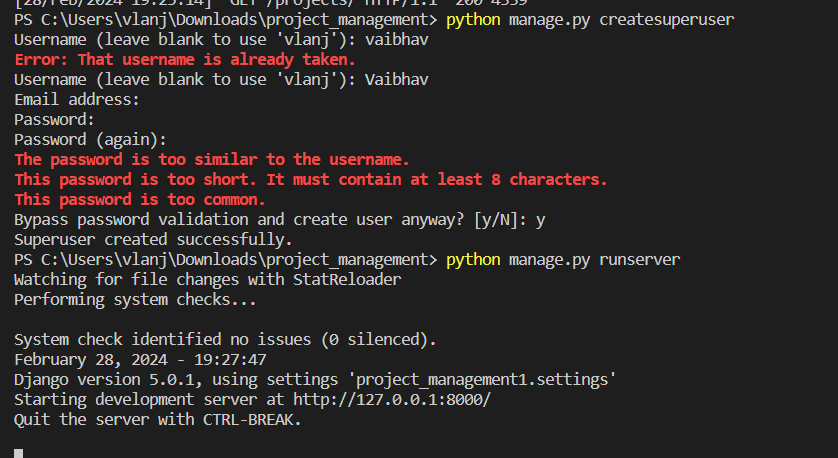
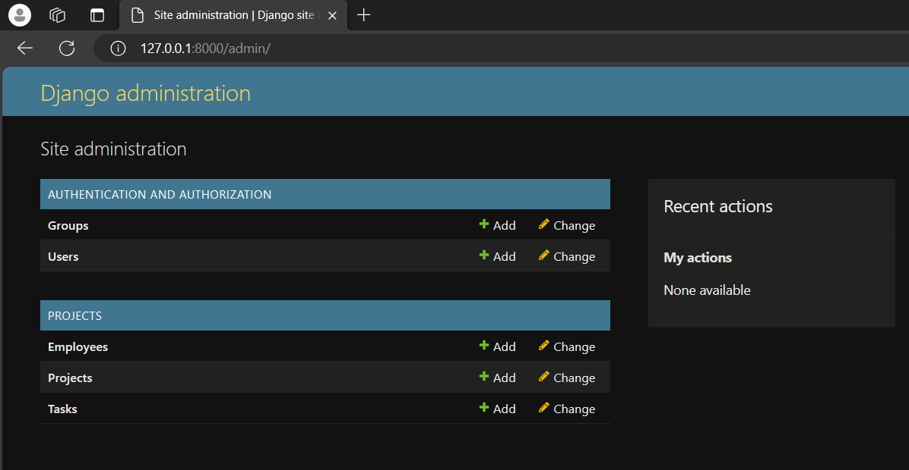
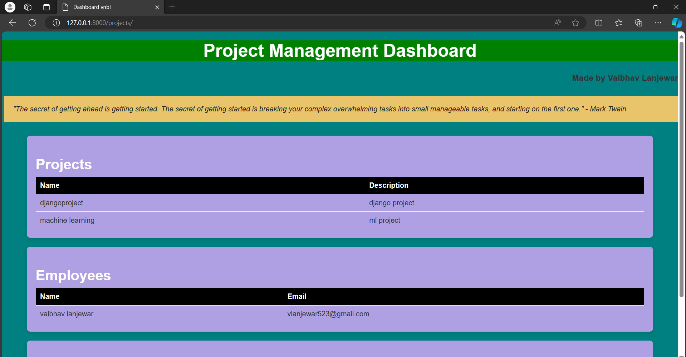

# Project_Management_tool_djangol
Django project for project management tool
<h1>Instruction</h1>
<h3 style="color:yellow">
<li>
  <ol>Download the Zip file </ol>
  <ol>Extract the zip file </ol>
  <ol>we have folder name cl3-practical-->inside again [cl3-practical]   
 </ol>
 
  <ol> open  terminal  upgrade python   then install django  </ol>
  <ol> Run command on terminal - pip install django   
</ol>
<ol>firstly you have to createsuperuser  run command command - python manage.py createsuperuser  
 </ol>
 <ol>Now run command terminal to see the backend - python manage.py runserver   http://127.0.0.1:8000/ like this and open on browser  http://127.0.0.1:8000/admin </ol>
 
 <ol>to see the frontend - http://127.0.0.1:8000/projects  provided that u have run command python manage.py runserver  
 </ol>
</li>
  </h3>

 
